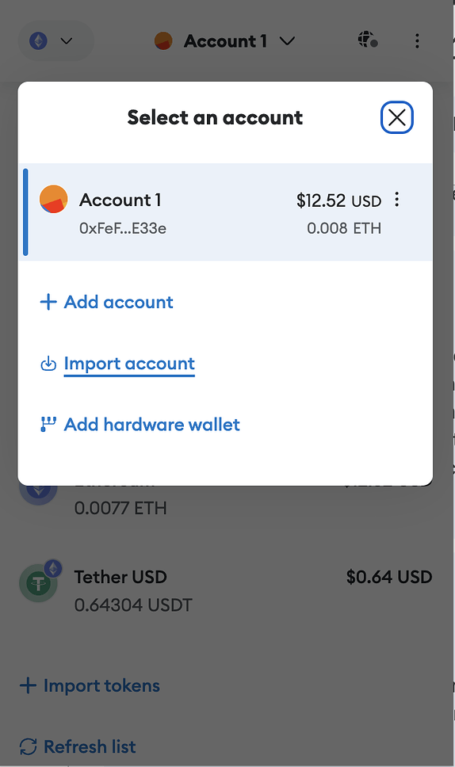
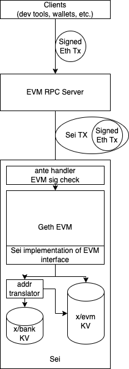
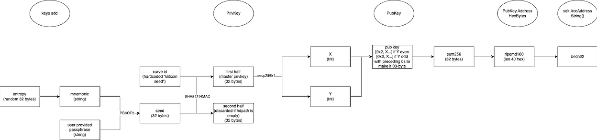

Author: @codchen03
# Overview

Ethereum VM (EVM) is the most popular environment for DApps at the moment, so supporting EVM contracts on Sei will be a major boost to the success of Sei's ecosystem. This doc discusses the approach we plan to take to seamlessly integrate EVM into Sei. Concretely, these are the goals that we want to achieve:

* EVM contract developers can use the same toolings (including Truffle, Remix, Hardhat) to develop, deploy, and upgrade on Sei as they do on Ethereum (aka allow existing Solidity contracts to be deployed on Sei with no additional work)
* Users can interact with EVM contracts on Sei with familiar wallets (e.g. Metamask, WalletConnect, Trust Wallet, Rabby)
* Users can use the same key (private key, usually in the form on mnemonics) to sign both normal Sei transactions and Sei EVM transactions
* Metamask users will install a Sei Snap to enable compatibility
* EVM on Sei will use `usei` instead of `wei` as the native token, and any balance change caused by EVM activity will be reflected in the account's corresponding bank balance
* EVM on Sei will charge gas following Ethereum's convention, except denominated in `usei` instead of `wei`
* Sei should support all Ethereum RPC endpoints so that existing Ethereum toolings can work with Sei without any change needed
* EVM contracts on Sei will have a way to access native tokens other than `usei` (e.g. IBC tokens, tokenfactory tokens)
* EVM support does not open up new attack vectors on Sei, whether from a liveness perspective or an economical perspective.
* [Milestone 2] Interoperability between EVM contracts and CosmWasm contracts on Sei

# User Journey

### Onboarding

##### Scenario A (Sei user trying out EVM)

1. A user would create an account with a Sei wallet (e.g. Compass) if they don't already have a Sei account.
2. A user would export their account's private key from their Sei wallet and import it into their favorite EVM wallet (except MetaMask) if they want to perform EVM activities.

1. In the future when we implement ambidextrous wallets that can make both Cosmos transactions and EVM contract calls, this step can be skipped.
2. 

3. A Metamask user will then add Sei Snap to Metamask to start doing EVM activity on Sei

1. Note that they would need to first have received useis in their account in order to pay for gas, similar to Ethereum

4. Although users will see their address as "sei…" on Compass and as "0x…" on MetaMask, it's the same underlying account and the balance is shared between the two.

##### Scenario B (EVM user onboarding to Sei)

1. A user would create an account with MetaMask (or other EVM wallets) if they don't already have one.
2. A user will add Sei Snap to Metamask to start doing EVM activity on Sei

1. Note that they would need to first have received useis in their account in order to pay for gas, similar to Ethereum

3. A user can then export their account's private key from MetaMask and import it into a Sei wallet if they want to perform non-EVM activities on Sei.
4. Although users will see their address as "sei…" on Compass and as "0x…" on MetaMask, it's the same underlying account and the balance is shared between the two.

##### Caveat on balances

Sei will only know the correspondence between an account's "sei…" address and its "0x…" address after the account sends its first transaction (e.g. a bank send). So if an account starts to receive funds on both its "sei…" address and its "0x…" address before ever sending a transaction, its balance will be shown as separate on Sei wallets vs. EVM wallets. The balances will be merged after it sends its first transaction.

### Funding

After step 1 in Onboarding is done, a user may start receiving funds with their Sei address via `bank send` messages.

After step 2 in Onboarding is done, a user may start receiving funds with their EVM address via `send` calls to `x/evm`. The user will have a unified balance reflecting funds received in both methods, which can be queried either through the bank module or through the evm module.

# Design

The diagram above illustrates the flow of an EVM transaction to Sei:

1. A Ethereum wallet (e.g. Metamask) signs a transaction in Ethereum fashion and sends it to Sei's EVM RPC server.
2. The EVM RPC server wraps the signed Ethereum transaction into a Sei transaction and sends it to a Sei node. Note that the Sei transaction here is not signed.
3. Sei's signature check ante handler detects that the transaction contains an EVM transaction, so it skips the normal Sei signature check and checks the signature within the Ethereum transaction payload through EVM instead.
4. The ethereum transaction is unwrapped and fed into Geth for execution.
5. Geth interacts with Sei's KV store through Sei's custom implementation of [the EVM interface](https://github.com/ethereum/go-ethereum/blob/master/core/vm/interface.go#L28):

1. The majority of EVM state will be stored in the KV store that belongs to the `x/evm` module. All keys under the same Ethereum account will have the same prefix and stored as individual IAVL nodes, instead of as a trie
2. Token balances will refer to the KV store of the `x/bank` module so that token activities on EVM are interoperable with token activities happening elsewhere on the chain. A special translator will be implemented to get the Sei address corresponding to an Ethereum address, leveraging the fact that both Sei and Ethereum generate keys via secp256k1.

Note that EVM queries follow the same flow except that queries aren't subject to signature checks and are read-only.

### Address Translator

Sei and Ethereum both generate public keys via a secp256k1 curve over private keys generated from a set of BIP-39 mnemonics. The difference lies in how the public keys are represented as addresses. The following diagram illustrates how a randomly generated mnemonic + user passcode gets mapped into an address on Sei.

On Ethereum, everything is the same except for the last three steps. Ethereum applies a different hash function over the public key, and takes the last 20 characters of the hash to serve as the address.

EVM operates on Ethereum addresses, so in order to be able to access Sei native states (e.g. bank balances), we need a way to translate Ethereum addresses into Sei addresses. Since the hashing function Ethereum uses is irreversible, we would need to maintain a mapping from Ethereum addresses to Sei addresses. To make it a smooth experience for the users so that they don't need to send explicit transactions to build such association, the only user-worry-free way to build it is through a correctly-signed Ethereum transaction - remember that to verify signature of a transaction, the signing algorithm will use signatures and signed data to recover the public key, generate address from the public key, and compare the addresses. So we can create an association between an Ethereum address and a Sei address when, and only when, that address sends a transaction. Although technically any transaction would serve this purpose, we will add a dedicated "enable" transaction type (with no payload needed) in `x/evm` to make it clear to the user that they are establishing an EVM address association.

It is also possible for an Ethereum address to be referenced before it ever sends any transaction. For example, a user might import their private key into MetaMask before "enabling" their account for EVM, and obtain their EVM address from MetaMask and share it with others. In such cases, the referenced Ethereum address, alongside with its token balance, will be kept in a special storage location (orphan bank), and will be claimed when the address sends its first Ethereum transaction, during which all of the orphan balance will be added towards the corresponding Sei address's bank balance. Naturally, all EVM contract addresses and balances will be forever kept in the orphan bank, since contracts do not have private keys.

When EVM needs the balance of an address, it will first check if it has any association with some Sei address, and use the Sei address's bank balance if it does. Otherwise it will treat it as an orphan address. If the address does not have association, nor exist as an orphan address, then the EVM will treat the account as non-existent.

We will expose a query endpoint for frontend/contracts to query the EVM address by a Sei address and vice versa.

### RPC Server

The RPC server can be the same process as Sei itself or a separate process. Ethereum already [defines](https://ethereum.github.io/execution-apis/api-documentation/) the RPC endpoints that a node should implement. We will implement all `eth_` endpoints that are relevant to Sei. Most importantly the following endpoints must be supported:

* estimateGas
* gasPrice
* getBalance
* getCode
* getStorageAt
* getBlockReceipts
* sendRawTransaction
* sendTransaction
* createFilter (used by backend toolings)

The implementation of the endpoints above will mostly be simple wrap-and-pass-through.

The most notable exclusions are:

* block-related endpoints, since Ethereum block structure is different
* filter-related endpoints
* `sign` endpoints due to [risk](https://support.metamask.io/hc/en-us/articles/14764161421467-What-is-eth-sign-and-why-is-it-a-risk-)

#### Differences between Ethereum

##### Block Info

* There is no block-level nonce, mix hash, or bloom filter on Sei
* Difficulty will always be zero on Sei since Sei is not PoW
* Uncles will always be empty since Sei does not employ probabilistic finality and only one block will ever exist for a given height

Make local RPC server configurable

Look into how to/whether we need to index EVM transactions (look at Evmos/Ethermint)

### Interoperability with other Sei modules

Interoperability with native modules like `bank` will be achieved via precompiles. A precompile is basically a Solidity wrapper over chain-level, customized read/write operations and is built into the chain with a fixed EVM address. Polaris has open-source implementations for auth, bank, staking, distribution modules that are ready for use. Specifically, the bank module precompile can be used by EVM contracts to send native tokens like IBC tokens and tokenfactory tokens.

Precompiles can also be used to enable interoperability between EVM contracts and CosmWasm contracts by implementing a precompile for the `wasmd` module. There is currently no existing implementation for `wasmd` but it should be doable by following the examples for other modules.

#### EVM access native tokens as ERC-20

We will create an ERC-20 implementation that delegates transfer/metadata function calls to `bank` precompiles and only handles approval-related permissions on contract-level (since `bank` doesn't have such capability). Every native token can choose to have an instance of this implementation deployed, with token-specific info (like token name) passed as constructor parameters, to EVM upon token creation, or deploy it later in a separate transaction `DeployERC20ForNativeToken` to `evm` module.

#### EVM access CW721 as ERC721

Similar to above, except that the delegated precompile would be the `wasmd` module.

#### CW access ERC721 as CW721

Similar to above, except that we will be creating a CW721 implementation that delegates calls through wasm bindings (similar to precompile in EVM) to `evm` module.

### Miscellaneous

#### Gas Treatment

Since we want EVM users to continue using existing Ethereum wallets to sign and send transactions, gas for EVM transactions will be specified on EVM-level. Specifically, the "gas limit" and "gas price" specified in an EVM transaction will all follow Ethereum conventions, and be checked/deducted using EVM-specific logics. One thing to note is that we will not adopt EIP1559's dynamic fee structure but use a static base fee (i.e. minimum gas price) that may be updated via governance. This decision is made because we don't yet have a good way to fit regular Sei transaction's fee model into Ethereum's economic model that underpins EIP1559.

In order to be able to compare priority (determined by unit price per gas) between EVM transactions and Sei transactions, we will introduce a parameter called "priority normalizer" to normalize EVM transaction priorities. For example, if there is an EVM transaction with a fee of 20000usei and 2000 EVM gas limit, and the normalizer is set to 2, then its priority will be 20000 / 2000 / 2 = 5, whereas a Sei transaction with a fee of 30000usei and 5000 Sei gas limit will have a priority of 30000 / 5000 = 6.

From Sei's perspective, it will follow a special logic to deduct fees for EVM transactions based on the EVM-level gas limit and a EVM-specific min gas price, and ignore any Sei-level gas arguments. One major difference in gas treatment between EVM transactions and normal transactions is that for EVM transactions, any leftover gas will be refunded to the user. If the EVM transaction runs out of gas during execution, there will not be any refund.

#### Anti-DDoS

The [duration-based fee proposal](https://docs.google.com/document/d/1FbbV3vQZnyM1xgZF-ug7zNCVlt_3Z9aD7Hng2OIveX0/edit) (rent) can be extended to cover EVM contracts as well.

#### Token Decimal Point

On EVM level all tokens are integers. In Ethereum the EVM operates on integer `wei`s, and on Sei the EVM will operate on integer `usei`s. One thing to note is that applications like MetaMask that originally display balances in `ETH` will by default display Sei balances in `Trillion Sei`, or 10^18usei, since one ETH is 10^18wei. Such user experience may be improved by extensions custom to Sei (e.g. MetaMask Snap).

# Community Discussion

- [Github Discussions for this RFC](https://github.com/sei-protocol/rfc/discussions/7)