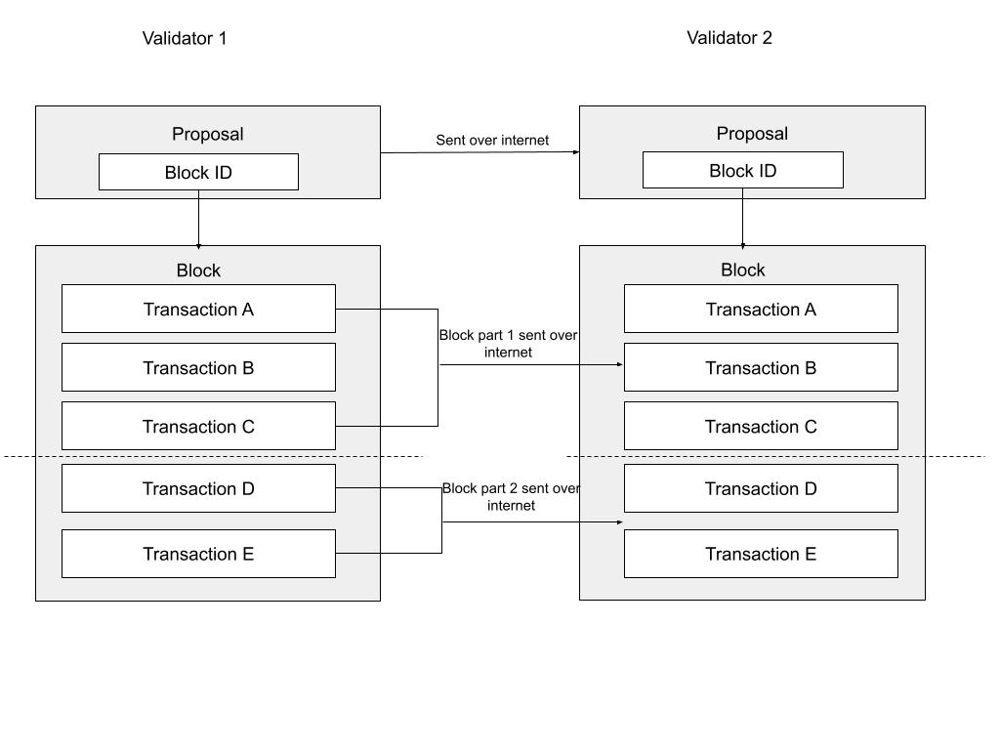
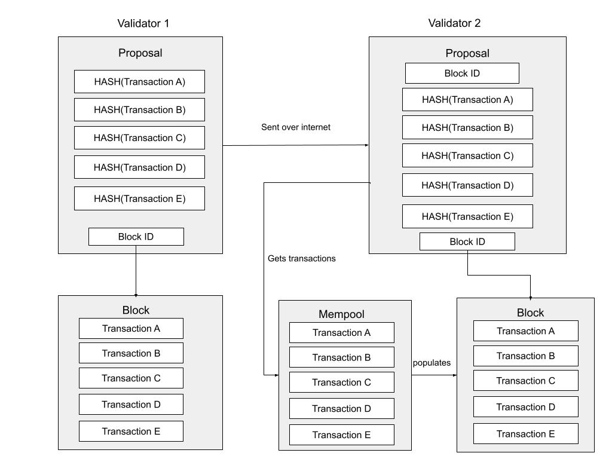

# Author
@psu

# Context
Previously, block proposers sent blocks that contained every transaction. Validators already gossip transactions between themselves at transaction submission, so most validators already have every transaction in their local mempool

# Solution
We collected metrics and identified that validators already had 99.99% of transactions in their local mempool via the gossip process! Validators needed to wait for all transactions to get sent to them, even though the transactions were already in their mempool

With intelligent block propagation, block proposers will now send a proposal that has a hash of every transaction that is part of the block. When validators receive the block proposal, they can use transactions from their mempool to quickly reconstruct the block

If validators don’t have all of the transactions in their local mempool, they can fall back to waiting for the contents of the entire block to arrive. We observed that intelligent block propagation resulted in ~40% increase in overall throughput and ~33% decrease in block times

# Community Discussion

- [Github Discussions for this RFC](https://github.com/sei-protocol/rfc/discussions/4)