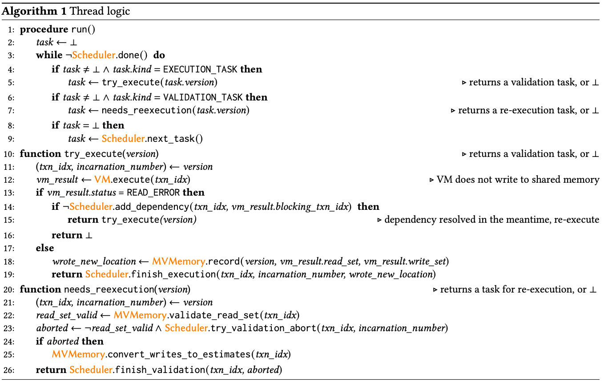
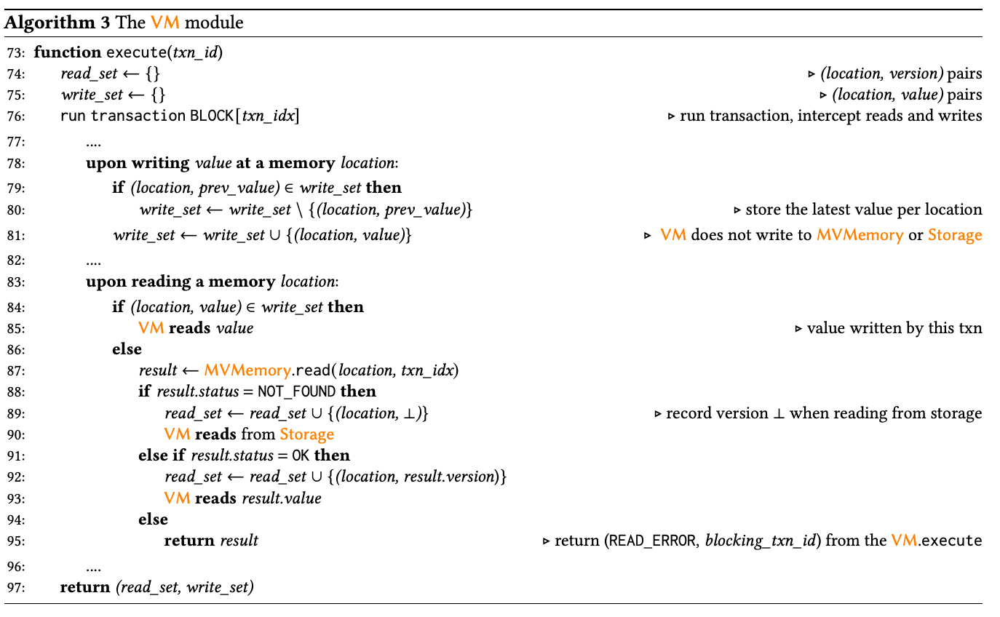
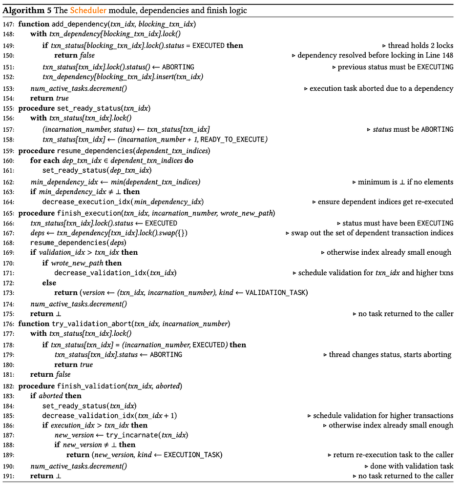
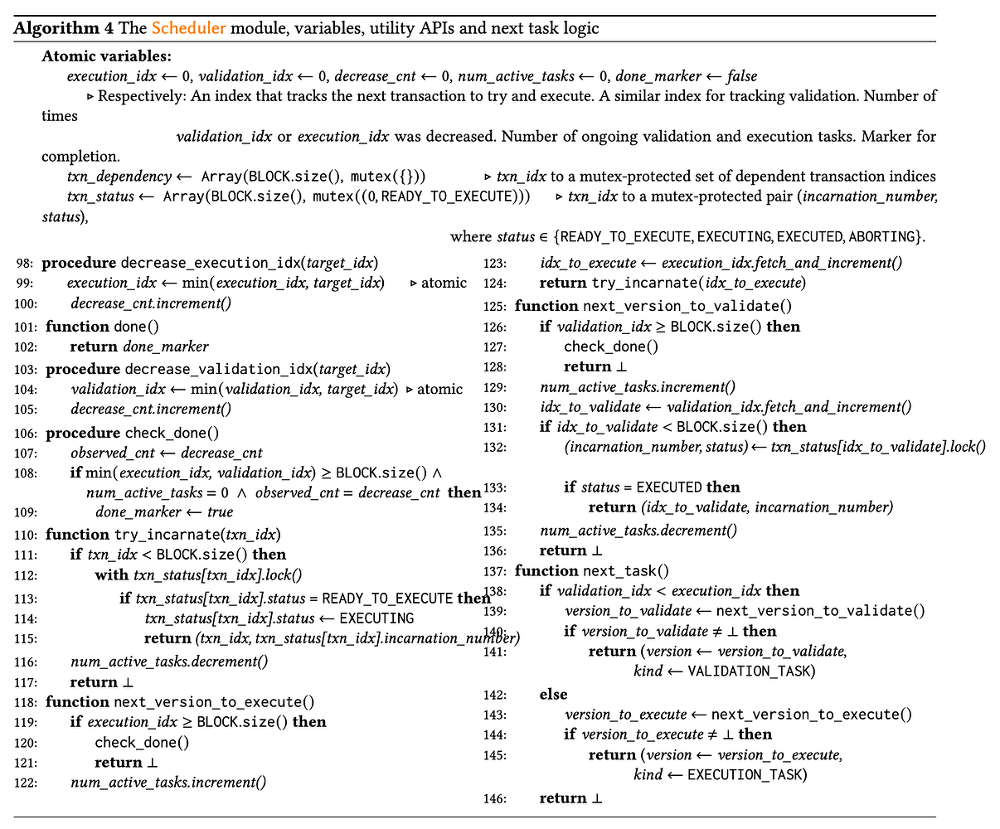
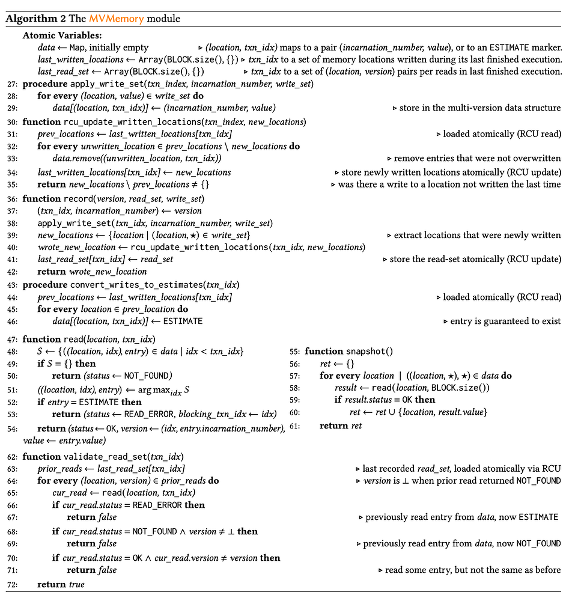
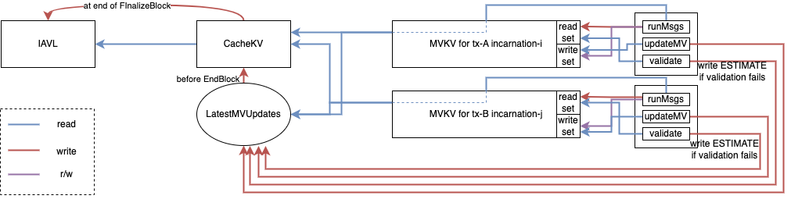
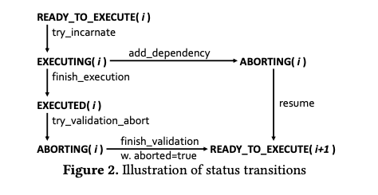

# Authors
@breakpoint @codchen03

# Context

Sei chain currently has the ability to process transactions concurrently using a dependency DAG approach. While this gives us the ability to accurately orchestrate transaction execution, it has a strict requirement of implementing dependency lists for transaction resource usages. This poses an issue for wasm contracts specifically, which require extensive developer involvement to properly declare dependencies to parallelize contracts. In this RFC, we discuss the requirements for design and implementation of Optimistic Concurrency Control similar to Block-STM as used by Diem and Aptos ([ref 1](https://arxiv.org/pdf/2203.06871.pdf)). Additionally, we will discuss the modifications we plan to make to the proposed design in the linked paper to further improve concurrent execution performance by utilizing some of the existing implementation for dependency based concurrency.

# Background

## Recommended Reading

[Block STM Paper
](https://arxiv.org/pdf/2203.06871.pdf)1. Introduction

2. Overview (Concepts)

3. Block-STM Detailed Description (Algorithm)

## TLDR

The above sections of the Block-STM paper are recommended reading for a more complete understanding of the Block-STM algorithm and concepts which are built upon in this RFC. This section will provide a high level overview (TLDR) of the paper for a minimal context of the algorithm.

Block-STM is an algorithm used to implement Optimistic Concurrency Control (OCC) for blockchain transaction execution. It enables the ability to execute transactions concurrently without having prior knowledge of resource access during transaction execution. The main way this is performed is by optimistically executing a transaction, and then validating the store access to verify that it wasn’t affected by prior transactions. To accomplish this, a transaction has two main stages, “execution” and “validation”, and can be executed multiple times, which is indicated by transaction “incarnations”.

### Transaction Lifecycle Terms

Execution - The stage in which the transaction is executed, and all reads / writes are stored in a temporary store specific to the transaction index

Validation - The stage in which the transactions store operations are compared to the modified state from prior transactions to determine whether there are conflicts that need to be remediated

Incarnation - The nth time that the transaction has undergone execution / validation. These stages may need to be run multiple times due to validation conflicts or READ dependencies encountered during execution

When we receive a block for processing, with say `n` transactions, we would like to run as many as possible concurrently, with priority on those earlier in the block transaction ordering. At this time, we want to initialize a multi-version store for the block, which can contain the state changes indexed by transaction index. This store will allow us to read the LATEST values for a given transaction index `j`, which for a key K, gives us either the value at the start of the block `Knil`, or the value `Ki` which is the value of key K for transaction index `i`, where `i` is the latest transaction that has written to key K that is prior to the current transaction index `j`.

As the transaction executes, we store a read-set and a write-set based on the keys / values that are respectively read and written. This allows us to perform validation checks after execution as well as update our multi-version store with the write-set that the transaction updated during execution. Once execution is completed, the write set is added to the multi-version store, and the validation task for the transaction is created. In the validation task, the transaction’s read-set is once again traversed, and the keys that were read and their corresponding values are compared to the current values present in the multi-version store. If there is no difference between them, we can consider the transaction to be valid and continue processing the other transactions until block completion.

However, if there is a conflict detected, this will generally indicate that some prior transaction wrote to a key that the current transaction read, but because the execution was performed concurrently, our current transaction read stale data (whether from a prior transaction or initial block state). As a result, we need to remediate the transaction, which takes the form of re-execution and re-validation. The transaction’s incarnation is incremented to indicate a re-run of the transaction, and this time it will execute with the more up to date multi-version store such that we would hope to no longer have a conflict during the eventual validation of this new incarnation.

To simplify the algorithm, these optimistic executions are paired with transaction validation and remediation through reincarnation to eventually reach a state where all of the block’s transactions have been executed and validated. The two main components that make this possible are the store layer that supports multi-version state and validation as well as the scheduler, which manages the lifecycle of transactions as well as their remediation process and downstream effects on other transactions. While there are more edge cases that require handling, the above process describes the core functionality of the Block-STM algorithm, and we will continue to discuss the more concrete deliverables below to implement a similar concurrency algorithm in sei-chain.

# Requirements

[P0] Enable concurrent execution of wasm contracts without dependency declarations being necessary and the following sub-goals to achieve this:

[P0] Implement a multi version store that allows for tracking per-TX store states

[P0] Implement a validation layer that will allow for detection and remediation of TX state write-set conflicts between concurrent transactions

[P0] Design and implement a scheduler system that will balance the resource utilization by TX execution and validation tasks, and appropriately prioritize tasks in order to minimize state conflicts

[P1] Implement dependency declaration optimizations (dependency prefills) that allow for common messages to be concurrently executed and conflicts to be proactively identified (eg. Bank Sends, Oracle Votes, etc)

[P1] Remove existing governance message remediation that causes block processing to become sequential

[P1] Replace underlying B-tree with concurrency safe BST for individual node concurrent access

## Potential Future Work

[P2] Transaction pre-fill estimates using simulate for access determination

[P2] Investigate Transaction pre-execution with read/write set validation and application within DeliverTX

# Proposed Solution

In this proposed solution, we divide the OCC implementation into four sections:

* multi-version store
* store tx validation
* tx execution/validation scheduler
* dependency based pre-fill optimization.

Block state initial: A0, B0, C0, D0

Latest MV Updates Store: B (B1, B3)

Tx 1: read key A, write key B (read A0, write B1)

Tx2: read B, write D

Tx3: write B

Tx4 : read B, write A (read set: B3)

## Algorithm Description

The following algorithms are taken from the Block-STM paper. For detailed explanation of these algorithms, please refer to the original paper.

#### Main Thread



#### VM.execute



#### Scheduler



#### Multi-Version Store



## Multi-Version Store

### Data Structures

###### Terminology

|Name in this RFC|Name in Block-STM Paper|
| --- | --- |
|LatestMVUpdates|data|
|[Ante] write set|last_written_locations|
|[Ante] read/iterate set|last_read_set|

There are two categories of data structures used to facilitate execution and validation of transactions:

* Global data structures - need to be accessible by all transaction threads. This is used to support store READs and transaction validations.
    * LatestMVUpdates - A map with (KV key (byte array similar to KVstore key in normal cosmos store), transaction index) tuple as the map key and (KV value, incarnation number) or a special ESTIMATE marker as the map value
        * this map needs to support both sequential (for iterator) and random lookup efficiently (e.g. a sorted map or skip list)
        * since this map needs to support sequential lookup just on KV keys, in practice it will be a map of maps
* Local data structures - working sets that are only accessible within each transaction thread
    * Ante write set - KV entries updated in the current incarnation in `anteHandler` phase
    * Ante read set - KV entries read by the current incarnation in `anteHandler` phase
    * Ante iterate set - iterator ranges, early stops if any, and iterated entry counts by the current incarnation in `anteHandler` phase
    * Write set - KV entries updated in the current incarnation in `runMsgs` phase
    * Read set - KV keys and versions (transaction index and incarnation number tuple) read by the current incarnation in `runMsgs` phase
    * Iterate set - iterator ranges, early stops if any, and iterated entry counts by the current incarnation in `anteHandler` phase
    * Last write set - KV entries updated in the last incarnation

As a global data structure, `LatestMVUpdates` will be initialized as an empty map before any transaction in a block runs. Each incarnation of each transaction will have access to the global map via an additional layer that implements Cosmos's `Store` interface over `cachekv`, called `mvkv`. An instance of `mvkv` corresponds to a specific incarnation of a certain transaction and will be initialized with empty read/write/iterate sets and a pointer to the global `LatestMVUpdates`.

#### LatestMVUpdates

We can do something similar to [MemDB](https://github.com/sei-protocol/tm-db/blob/main/memdb.go#L51) (the backbone of `CacheKV`) which is protected by a mutex and backed by a B-tree. Specifically, `LatestMVUpdates` will have the following item definition:

```

type keyItem struct {

key []byte // application KV key

value *btree.BTree

}

func (i keyItem) Less(other btree.Item) bool {

return bytes.Compare(i.key, other.(keyItem).key) == -1

}

```

whereas the `value` B-tree will have the following item definition:

```

type txItem struct {

txIdx int

incarnation int

value []byte // application KV value

}

func (i txItem) Less(other btree.Item) bool {

return i.txIdx < other.(txItem).txIdx

}

```

The reason for such setup is because a read for a certain key in `LatestMVUpdates` should always look for the value written by the nearest transaction that has a smaller index than the current one. For point queries, this setup allows us to locate the secondary tree by the key, and then use a reverse iterator query with the current transaction index and limit 1 to find the target value. The reason for the outer layer to also be a B-tree instead of a normal map is because for iterator-based queries, we need to be able to iterate over keys in order.

In the future, to further optimize performance, we can replace the underlying B-tree with a thread-safe binary search tree ([ref 2](https://stanford-ppl.github.io/website/papers/ppopp207-bronson.pdf)) so that locking happens on tree node level, instead of globally. There does not seem to exist a reliable open source Golang implementation of that yet, so we will have to build the wheel if it turns out we need to make this optimization.

#### Write Set

Write sets need the same access properties as `LatestMVUpdates` except that it doesn't need to be thread-safe (since only the enclosing transaction thread needs to access it), so we can simply use the [B-tree](https://github.com/google/btree/blob/master/btree.go#L588) structure that MemDB uses.

#### Read Set

Since we don't need sorted iteration on read sets, they can be simple maps between keys and versions. Read sets also don't need to be thread-safe since at any given moment there must be at most one thread (either one execution thread or one validation thread) accessing it at the same time.

#### Iterate Set

This can be a simple list of tuples.

### MVKV Implementation

`mvkv` will wrap a `cachekv` instance as the parent store (similar to how [tracekv](https://github.com/sei-protocol/sei-cosmos/blob/main/store/tracekv/store.go#L27) is defined), and overwrite the `Store` interface methods

#### Get/Has

Implemented by performing the following steps sequentially:

1. Read from `mvkv`'s write set and return if found
2. Read from `mvkv`'s ante write set and return if found
3. Read from `LatestMVUpdates` for (k, j) where k is the key to be read and tx-j is the largest index smaller than the current transaction's index

1. if a value is found, return the value
2. if `ESTIMATE` is found, abort

4. Read from the parent

Always update the read set or ante read set depending on the context, even if the key does not exist.

An optimization over the original Block-STM that we can make here is to abort immediately if the read set already has the key but maps to a different version, which implies the current incarnation has seen different versions of the same key. In the original Block-STM, read sets are simple lists so reads of different versions are all appended and the invalidity of the incarnation will only be found during the validation phase.

#### Set

Write to the write set or ante write set depending on the context. `Set` should not write to the parent store or the global `LatestMVUpdates` map.

#### Delete

Write to the write set or ante write set with a special TOMBSTONE marker. Similarly `Delete` should also not write to the parent store or the global `LatestMVUpdates` map.

#### Iterator

Use a combined iterator that consists of the following iterators, ordered in precedence (i.e. which iterator's value to use if the same key exists in multiple iterators):

1. 'mvkv' write set iterator
2. 'mvkv' ante write set iterator
3. `LatestMVUpdates` iterator
4. Parent iterator

Every key read needs to be added to the read set as well.

The original Block-STM is built for Aptos which does not support iterators, so the validation logic also does not take potential iterator failure scenarios into account. Specifically, if transaction B that uses an iterator and finishes execution, and then transaction A (which comes before transaction B in the block) inserted a key that falls into the iterator range, validation would still pass since there is no record of transaction B having anything to do with this new key. To fill this gap, we need a special read set called "iterate set" to denote the iterated range, early stop keys, as well as the number of entries iterated. Later in the validation logic, we can then leverage this information to replay the iterator, compare the outcome with the read set, and capture the failure scenario as described above. We will break down different iterator scenarios below:

* Transaction 10 iterates from key 123 to 456 and sees key 124 and 220. Transaction 5 inserts key 210.
    * The validator for tx-10 will see a tuple of (123, 456, n/a, 2) in the iterate set and replay the iteration with no early stop. It will get 3 entries instead of 2. Thus the validation should fail.
* Transaction 10 iterates from key 123 to 456, sees key 124, and stops early at key 124. Transaction 5 inserts key 123.
    * The validator for tx-10 will see a tuple of (123, 456, 124, 1) in the iterate set and replay the iteration with early stop. It will get 2 entries instead of 1. Thus the validation should fail.
* Transaction 10 iterates from key 123 to 456, sees key 124, and stops early at key 124. Transaction 5 inserts key 125.
    * The validator for tx-10 will see a tuple of (123, 456, 124) in the iterate set and replay the iteration with early stop. It will get 1 entry as expected, and move on to the rest of the validation (e.g. whether 124 is in the read set and if the version of 124 matches).
* Transaction 10 iterates from key 123 to 456, sees key 124, and stops early at key 124. Transaction 5 removes key 124.
    * The validator for tx-10 will see a tuple of (123, 456, 124, 1) in the iterate set and replay the iteration with early stop. It will get 0 entries instead of 1. Thus the validation should fail.
* Transaction 10 iterates from key 123 to 456, sees key 124, and stops early at key 124. Transaction 5 inserts key 123 and removes key 124.
    * The validator for tx-10 will see a tuple of (123, 456, 124, 1) in the iterate set and replay the iteration with early stop. It will get 1 entry as expected, but the subsequent read set check of that entry (123) would fail. Note that the read set check would fail even if tx-10 reads key 123 somewhere else, because the versions would not match.
* Transaction 10 reverse iterates from key 456 to 123, sees key 220, and stops early at key 220. Transaction 5 inserts key 221.
    * The validator for tx-10 will see a tuple of (456, 123, 220, 1) in the iterate set and replay the iteration with early stop. It will get 2 entries instead of 1. Thus the validation should fail.
* Transaction 10 reverse iterates from key 456 to 123, sees key 220, and stops early at key 220. Transaction 5 inserts key 219.
    * The validator for tx-10 will see a tuple of (456, 123, 220, 1) in the iterate set and replay the iteration with early stop. It will get 1 entry as expected, and move on to the rest of the validation (e.g. whether 220 is in the read set and if the version of 220 matches).
* Transaction 10 reverse iterates from key 456 to 123, sees key 220, and stops early at key 220. Transaction 5 removes key 220.
    * The validator for tx-10 will see a tuple of (456, 123, 220, 1) in the iterate set and replay the iteration with early stop. It will get 0 entries instead of 1. Thus the validation should fail.

#### Iteration Validation Optimization Brainstorming

If we store the sorted cache in a balanced BST structure, it may be possible to further optimize the validation process for iteration using merkle hashes. When performing our iteration, we can do an additional step of finding the Lowest Common Ancestor (ref: https://www.geeksforgeeks.org/lowest-common-ancestor-binary-tree-set-1/#) and store the merkle hash for that in the `iterate set` struct. Then, when we would like to validate the iterate set, we can once again find the lowest common ancestor and compare that merkle hash to the previous one from the iterator set. IFF the hashes are different, we suspect that there was some change performed that may invalidate the initial iterate set, and as such we would need to replay the iteration to validate it.

Upon further thought, this likely will not work because after the initial iteration, it is reasonable to assume that the lowest common ancestor will change, at which point we would have to once again find the lowest common ancestor. This would be an O(n) operation, at which point it will likely be just as efficient to replay the iterator.

Another potential way to make iterate set validation more efficient would be to construct an interval tree ([ref 3](https://en.wikipedia.org/wiki/Interval_tree)). Using this, we can identify whether writes and deletes would fall within an iterated interval, and as such, mark specific intervals for remediation. This ongoing interval validation would mean that writes / deletes happen in log time, but this would likely already be the case for the sorted structure used for storing the sorted cache for later iteration validation. It may be possible to implement some hybrid tree structure that would allow for storing written values and iterated intervals that we can then use for iterator validation, but this implementation may be prohibitively complicated since there like isn’t a good open source solution, and the gains to be made may be meaningful but not significant enough as to be attempted in an initial implementation of this Multi Version Store.

### State Update Logic

`LatestMVUpdates` are written by each incarnation at the end based on write sets. After that, validation based on read sets and `LatestMVUpdates` is performed. If validation fails, the previously written entries in `LatestMVUpdates` by this incarnation are replaced with the ESTIMATE mark, and a new incarnation for this transaction will be scheduled.

#### Error cases

##### Ante Error

Nothing will be written to `LatestMVUpdates`, and validation will only be run with the ante read/iterate set.

##### Ante Succeed but RunMsgs Error

Only the ante write set will be written to `LatestMVUpdates`, and validation will be run with both read/iterate sets.

##### Successful Case

Both write sets will be written to `LatestMVUpdates`, and validation will be run with both read/iterate sets.

#### Commit

After all pre-MidBlock transactions have finished with validity but before MidBlock runs, we will flush `LatestMVUpdates` to the underlying `CacheKV` (namely [here](https://github.com/sei-protocol/sei-chain/blob/main/app/app.go#L1350)). Then before post-MidBlock transactions run, we will re-initialize the `LatestMVUpdates`, and flush it before EndBlock runs.

The following diagram summarizes the relationship and IO between the new components and logic:



## State Validation

In order to validate the tx, we will need to iterate over the TX’s read-set and check the values at index `i` in the multi version store. If there is a newer / different value that is read during validation, we can abort the TX and restart it since presumably the write set modification may have changed the outcome.

## TX Scheduler

The block-STM concurrency model is built around a fixed number of threads / workers that will process the execution, validation, and state transition tasks. However, it may be possible to coordinate the concurrency with goroutines where we use channels to coordinate waits on other goroutines, and we can basically fire off ALL goroutines for block TXs at once. This could have a downside that the goroutines for earlier TXs aren’t prioritized, leading to increased contention. As a result, having a worker based system with prioritized schedule tasks may be the best approach. This also would allow for config level tuning of concurrency since number of workers could be adjusted based on the available hardware to prevent potential thrashing in case of too many thread workers.



### States

#### READY_TO_EXECUTE

● Transactions start in this state, and as their execution is begun, we transition from this state to EXECUTING to indicate that they are currently undergoing processing

● For a given incarnation `i`, a transaction will never return to READY_TO_EXECUTE(i) after transitioning out of that state. Any further READY_TO_EXECUTE states will be accompanied by an incremented incarnation index

● This ensures only once execution

#### EXECUTING

● The goroutine that executes the transaction will move into this state from READY_TO_EXECUTE, and then once the function is done running for TX execution, the goroutine will proceed to move the TX state from EXECUTING to EXECUTED.

#### EXECUTED

● The TX will enter this state after executing. Along with the state transition, we will also create an appropriate validation task for the TX AND unblock any downstream dependencies that may have been waiting on this ex’s ESTIMATEs

#### ABORTING

● There are two ways that a TX may enter an ABORTING state. The first is after execution, during validation. If an error is detected while validating, we will proceed to abort the TX incarnation, requiring another incremented incarnation to run after remediation of the root cause of abortion. This will generally cause reincarnation due to conflict between the TX read-set and an upstream write-set

● The other reason may be during the EXECUTING state while the TX is performing application logic, if it reads an ESTIMATE value. In this case, we need to pause the TX execution since it will need some values that are yet to be written by an upstream TX. In this step, we add a dependency to the upstream TX (to be notified upon reaching EXECUTED) and then abort the current incarnation of our current TX. Then, we will eventually enter the READY_TO_EXECUTE state with incarnation incremented after the upstream dependencies have been resolved.

## Dependency Pre-fill Optimization

Prior to setting TXs in READY_TO_EXECUTE, we can further optimize potential contention using our existing knowledge of message dependencies to identify keys that will be written by some TXs. Using this, we can have an earlier state prior to the 0th incarnation called `PREFILL` where TXs have their dependencies evaluated, and the Multi Version Store is seeded with prefilled ESTIMATEs based on the identified WRITE dependencies. For example, if transaction J has a generated read dependency that it will read XYZ, and transaction I (where TX i is prior to j) has a write dependency generated for key XYZ, we will have populated the shared data store with the key (I, XYZ) with a value of `ESTIMATE`, indicating that TX I will write to XYZ.

We can only do this in cases when we have dynamic dependency generators that allow us to acutely identify the key being written, since holding ESTIMATES on a key prefix would create unnecessary contention versus simply allowing remediation to occur after validation. This will introduce some additional overhead, BUT will provide returns in the case of popular smart contracts that receive multiple transactions in a block, or in the case of heavy activity such as staking / unbonding from validators, since that does cause a WRITE dependency on staked balances and such.

This pre-fill can be implemented with a gated approach where ESTIMATE pre-fill will only be attempted if indicated in a config file, and this will allow us to properly A/B test and benchmark concurrency performance WITH and WITHOUT prefilled ESTIMATES. However my theory is that it will hurt best case performance (due to unnecessary overhead in a low contention scenario) while improving worst case performance (reducing the number of incarnations / compute necessary in high contention workload) because dependent TXs will be proactively identified.

# Community Discussion

- [Github Discussions for this RFC](https://github.com/sei-protocol/rfc/discussions/3)