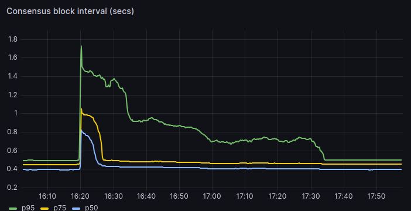
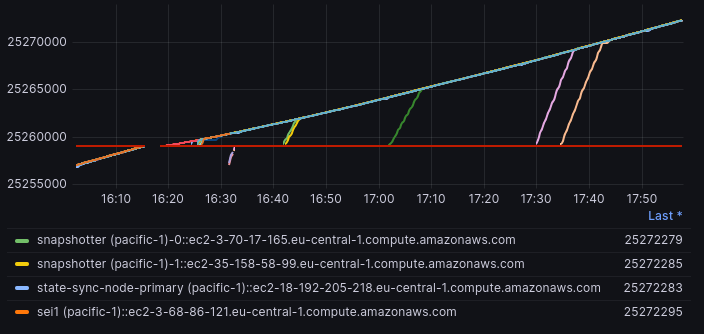

# Authors
@steven @breakpoint

# Context

Currently, the upgrade process involves network-wide downtime for several seconds with impact over several minutes while nodes upgrade to the latest software version.

Example upgrade impact, for consensus block intervals.



Example upgrade impact, for block height (note the gap)



Technically, not every release requires all validators to be on exactly the same version at exactly the same block height. Only those changes where consensus would not otherwise succeed (app-hash-breaking changes) require that level of coordination.

This project aims to make online upgrades for minor and patch releases possible so that non-major upgrades require no downtime.

## Major vs. Minor Upgrades

For our purposes, we define major vs. minor upgrades as follows:

A major upgrade requires a unified upgrade moment, and where all validators must be on the same version at the exact same block height and not one block before. This includes changes that would break consensus if coexisting with the current active version.

A minor upgrade tolerates validators upgrading at different times before a designated block. This includes changes that do not break consensus if coexisting with the current active version. A minor upgrade is still required after the designated block height deadline.

Per [semantic versioning](https://semver.org/) guidelines, there are three components to a version, for example, for v3.2.5, 3 = major, 2 = minor, 5 = patch. For the purposes of this RFC, minor upgrades will be for minor or patch releases.

# Open Questions

* How do reverted/canceled upgrades work after an upgrade proposal has been passed?
    * Can it roll back before the block height? (or does it always march forward?)
        * Yes, there is a cancel-software-upgrade concept
            * Once canceled, what should happen to those who have already upgraded? Maybe it could force-upgrade to the previous version via panic and UPGRADE-NEEDED message. If enough has upgraded we probably want to be careful about canceling (don’t want a massive outage)
    * Can it roll back after the block height? (or does it always march forward?)
    * We’d need a way of being tolerant to being not-yet-rolled-back during that transition
* How does upgrading over multiple versions work (It looks like it would jump straight to the latest binary, which contains previous version handlers. If so, we’re fine.)?
* Autodownload / Cosmosvisor
    * Is our [cosmosvisor codebase](https://github.com/sei-protocol/sei-cosmos/tree/main/cosmovisor) used by our validators?
    * Do we have some way of distributing binaries if we wanted to do auto-downloads? (Phase III)
    * Are the cpu architectures consistent (linux/64)?

# Requirements

[P0] Ensure network is tolerant to manually-installed approved minor/patch releases

[P0] Cosmosvisor continues to work (not broken) for both major and minor releases

[P0] Validators do not need to upgrade at exactly the same time

[P1] Increase visibility of validator versions (not solved here)

[P1] Tolerate versions that are not alphabetical in order (v3.0.10 > v.3.0.9)

# TLDR; Proposal Summary

These changes are split into three phases. It may make sense to combine some of these (e.g., phase I and II, or II and III), but I split them out because they are technically coherent as milestones.

Phase I:

Enable manual upgrades for minor releases in the Cosmos binary. The binary won't panic during minor upgrades but will defer to node operators to install the new version manually. An ability to specify the upgrade type is introduced.

Phase II:

Cosmosvisor will facilitate automatic upgrades based on two conditions: presence of the new binary locally and detection of an UPGRADE SCHEDULED log from the running Cosmos binary. Timing for upgrade will be calculated based on a validator's voting power. This phase ensures seamless upgrades once prerequisites are met.

Phase III:

Cosmosvisor gains the ability to auto-download binaries. If a new binary isn't found locally, and if auto-downloads are enabled, Cosmosvisor will fetch, verify, and install the necessary binary, leveraging sha256 checksums for security.

# Proposed Phases

## Phase I: Enable Early Manual Upgrades for Minor Releases

In this phase, the objective is to make the Cosmos binary tolerant of manual upgrades for minor releases.

This means that instead of the binary panicking during a minor release upgrade, it would continue to operate, deferring the actual upgrade until a manual action is taken by the node operator. Panicking would remain the response to premature major release upgrades or once the deadline is reached.

This will rely on operators to install an upgrade at their discretion before the deadline.

Release Timeline (example)

Changes to upgrade proposals

* Use the --upgrade-info property and introduce upgradeType. By default, we would consider the upgrade a major upgrade.
* If not specified we should default to major
* This should then become a property of the upgrade proposal (similar to height, description)

Example
```
seid tx gov submit-proposal software-upgrade "$VERSION" --title "$VERSION" --from admin --fees 800000usei -b block -y --upgrade-height="$HEIGHT" --description "$DESCRIPTION" --deposit 20sei --upgrade-info '{ "upgradeType": "minor" }'
```
Changes to BeginBlocker in abci/upgrades.go

* Differentiate between major and minor upgrades within the Cosmos binary.
* Avoid logging UPGRADE NEEDED when a minor release is detected unless the final block height has passed. (If this logs, cosmosvisor will kill the binary and we don’t want that to happen)
* Avoid [panicking](https://github.com/sei-protocol/sei-cosmos/blob/main/x/upgrade/abci.go#L80) if a handler is not present if this is a scheduled minor upgrade (and the block height has not yet passed, otherwise yes, panic)
* Avoid [panicking](https://github.com/sei-protocol/sei-cosmos/blob/main/x/upgrade/abci.go#L94) if running a newer-than-required release if it is a scheduled minor upgrade

Logging Upgrade Notifications:

* When a minor release upgrade is detected, log a clear message urging node operators to manually upgrade. This log can be monitored by external alerting tools to notify operators.
    * We could make this a formatted UPGRADE SCHEDULED message that a modified cosmosvisor could later detect.

## Phase II: Enable Automatic Upgrade Initialization by Comsmosvisor

In Phase II, cosmosvisor will be equipped to initiate automatic upgrades when BOTH of these two conditions are met:

* The new binary exists locally (having been manually placed by the operator)
* An UPGRADE SCHEDULED log message is detected from the running Cosmos binary.

Example where manual installation occurs first

Example where manual installation occurs second (delayed)

Once both dependencies are met, Cosmosvisor upgrades/restarts the binary.

Timing Calculation for Upgrade:

* Introduce logic to calculate the appropriate upgrade time for a validator based on their voting power. Lowest voting power first. The validators will be evenly distributed between the block height of the proposal passing and the block height deadline.
    * Note: This represents the earliest upgrade time. If the operator does not install the binary, the upgrade will be delayed until they do.
    * Regardless of the calculated time, all nodes will force-upgrade, if not upgraded already, at the block height (just like today).
* Voting power at the proposal pass block height (pegged to avoid any dramatic changes)
    * If a validator for some reason didn’t exist when the upgrade proposal passes, we can default its timing to the deadline.
* If for some reason someone manually upgrades the binary and restarts before their upgrade time, that will be tolerated (it won’t be deemed too early)

Cosmosvisor Notification:

* When the determined time for a node's upgrade arrives and a new binary exists locally, the Cosmos binary will produce a special log entry: UPGRADE SCHEDULED (with formatted structure).
    * Note, this will not panic when emitted
    * Given a high rate of blocks, we may want to emit this log every N blocks to avoid performance impact.
* Similarly to today’s UPGRADE NEEDED message, cosmosvisor will monitor for this log entry to initiate the automatic minor upgrade process.

Cosmosvisor Binary Check and Upgrade:

* Upon detecting the UPGRADE SCHEDULED log entry, cosmosvisor will check for the existence of the new binary in the specified directory.
    * If it exists, then it can kill the binary, and start the new binary.
    * If it does not exist, it will do nothing

## Phase III: Enable Cosmosvisor Automatic Downloads

Cosmosvisor currently supports the ability to download binaries automatically, if binaries are defined in the upgrade-info as follows.

Example binary specification (see Cosmosvisor [documentation](https://docs.cosmos.network/v0.45/run-node/cosmovisor.html))
```
{
"binaries": {
"linux/amd64": "https://example.com/gaia.zip?checksum=sha256:aec070645fe53ee3b3763059376134f058cc337247c978add178b6ccdfb0019f"
}
}
```
This requires that we publish binaries to a location and populate the sha256 checksum. The [gogetter](https://github.com/sei-protocol/sei-cosmos/blob/main/cosmovisor/upgrade.go#L60) will automatically verify the checksum to ensure file integrity.

We need to adjust Cosmosvisor to be able to notice MINOR (upgrade scheduled) upgrade logs. This needs to be handled separately to accommodate the scenario where the operator manually installs binaries and has not yet done so. (Major kills the service, Minor would not until the next binary exists)

Cosmosvisor Adjustments

* Upon detecting the UPGRADE SCHEDULED log entry, cosmosvisor will check for the existence of the new binary in the specified directory.
    * If it exists, then it can kill the binary (since it now does not panic by itself), and start the new binary.
    * If it does not exist and automatic downloads are enabled
        * Trigger the [DoUpgrade](https://github.com/sei-protocol/sei-cosmos/blob/main/cosmovisor/upgrade.go#L21) logic to download, verify, and install the new binary

# Design Decisions

## How do we prevent all validators from automatically upgrading at once?

### Option 1: Lowest voting power first

Rank all validators from lowest to highest voting power. Calculate the proportionate time offset between the upgrade proposal passing height and the block height required by the upgrade. If that block is now (or in the past) then upgrade.

Pros

* Straightforward and easy to explain
* It allows for evenly distributed upgrades
* Easier to test behavior

Cons

* Voting power can change, so it just needs to be some sensible strategy (the block height of the proposal passing)
* There are some edges to consider like if a new validator comes online during the rollout. Their upgrade moment may need to be ‘now’ or wait until the block-height if not present in the voting power list.

### Option 2: Random Delay

Choose a random block between the upgrade vote passing and the block height required by the upgrade. If that block is now (or in the past) then upgrade.

Pros

* Simple to implement (with some edges to consider)

Cons

* Without some coordination, it’s still possible to have outages (violation of requirement)
* Not as predictable - it’s nice to be able to avoid an unexpected upgrade bomb where an unlucky large set of validators upgrade at once. With a small set of validators this is more impactful.

Preference: I prefer option 1, for stability/predictability reasons.

## What drives whether this is a major or minor upgrade?

When releasing a new chain upgrade, the system must decide whether this is a major or minor upgrade so that it knows whether it can upgrade before the target block height.

### Option 1: Add to the upgrade proposal

Pros

* Flexibility: Allows us to operationally decide and communicate whether it’s an online upgrade
    * In theory a major release version (with additive capabilities) might prefer a minor upgrade for impact reasons
    * In theory a minor release version may sometimes require a major upgrade
* It is explicit, because everyone can refer to whether it’s a major or minor upgrade without deriving it from version numbers.

Cons

* It introduces a moment where we have to set this property correctly (which could introduce a mistake)

### Option 2: Dynamically derive major vs. minor via release version diffs

Pros

* One lever for whether something is online or not: the version number

Cons

* If for any reason we need a major upgrade deployment (for any other reason), we MUST increase the major version

### Option 3: Use a different field that exists (description, upgrade-info json, etc)

Pros

* Flexibility
* Does not require any changes to the upgrade proposal specification

Cons

* Little less explicit than an explicit upgrade type, but really it feels like an improvement on option 1 given the lack of protocol adjustment.

Preference: I prefer option 3, for flexibility to avoid adjustments to proto (if adjustments are easy, I do prefer the explicit upgrade-type flag)

## How should updates be distributed for Phase III?

### Option 1: Build Binaries and distribute via Cosmosvisor’s Auto-download capability

Pros

* Cosmosvisor already supports much of this

Cons

* There are challenges with building for different CPU architectures

### Option 2: Teach Cosmosvisor to dynamically build the binary

Pros

* All binaries are built on the specific validator (avoiding the cpu architecture)

Cons

* There are likely some variations on figuring out the local directory structure and git configuration

Preference: If we can solve the cpu architecture problem (we could build many binaries via CI/CD), I prefer option 1 because it’s a less complicated and consistent option for cosmosvisor. If not, of course, the constraint forces us to consider option 2.

# Community Discussion

- [Github Discussions for this RFC](https://github.com/sei-protocol/rfc/discussions/2)